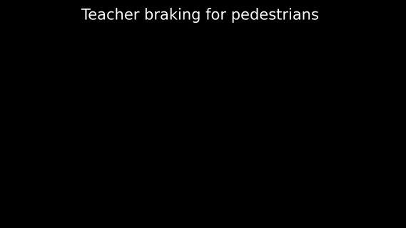

# Learning from interventions

Two models predict driving actions: a student and a teacher. The student
perceives RGB camera input. The teacher perceives a ground-truth map of the
world. Normally, the student is in control of the vehicle. The teacher
intervenes when it disagrees with the student. Each time the teacher
intervenes, a failure mode of the student is signalled. This intervention data
is used to improve the student.

## Examples

Waypoints are represented as circles; arcs represent the turning radius
calculated from these waypoints. Orange indicates student driving. Blue
indicates teacher driving. Only one model is in control of the vehicle at any
one time. Predictions of the model that is _not_ in control are gray.

<p align="center">
    
    <br>
    <em>The student makes mistakes, the teacher intervenes in time.</em>
</p>

<p align="center">
    
    <br>
    <em>Student driving after learning from interventions.</em>
</p>

## Quickstart

This quickstart you have [CARLA Simulator](https://github.com/carla-simulator/carla)
installed.

```shell
# Clone this repository
$ git clone https://github.com/tomcur/intervention.git
$ cd intervention

# Install dependencies (more detailed instructions can be found below)
$ python3 -m pip install -r requirements.txt
$ python3 -m pip install -e .

# Download the student network checkpoint
$ wget https://churchman.nl/assets/intervention-student-i-r-nr-16.pth

# Start CARLA simulator (in a different shell)

# Evaluate the student agent
$ intervention-learning collect-student \
    --directory ./test-student \
    --num-episodes 3 \
    --student-checkpoint ./intervention-student-i-r-nr-16.pth \
    --metrics-only
```

## Usage

For general usage information, see `intervention-learning --help`.

To collect imitation-learning data from an expert driver, first download the
expert model from [the Learning by Cheating
publication](https://github.com/dotchen/LearningByCheating):

```shell
$ wget http://www.cs.utexas.edu/~dchen/lbc_release/ckpts/privileged/model-128.th
```

1) Run [CARLA Simulator](https://github.com/carla-simulator/carla). Then
collect a dataset of teacher examples.

```shell
$ intervention-learning collect-teacher \
    --teacher-checkpoint ./model-128.th \
    --directory ./teacher-dataset \
    --num-episodes 500
```

2) Train a student model from this dataset.

```shell
$ intervention-learning train-imitation \
    --dataset-directory ./teacher-dataset \
    --output-directory ./student-checkpoints \
    --target-source teacher-prediction \
    --loss-type cross-entropy \
    --num-epochs 10
```

3) Collect intervention data from the student with teacher oversight.

```shell
$ intervention-learning collect-intervention \
    --student-checkpoint ./student-checkpoints/9.pth \
    --teacher-checkpoint ./model-128.th \
    --directory ./intervention-dataset01 \
    --num-episodes 250
```

4) Fine-tune the student model by learning from these interventions.

```shell
$ intervention-learning train-intervention \
    --intervention-dataset-directory ./intervention-dataset01 \
    --imitation-dataset-directory ./teacher-dataset \
    --target-source teacher-prediction \
    --loss-type cross-entropy-swapped \
    --output-directory ./finetuned-student-checkpoints \
    --initial-checkpoint ./student-checkpoints/9.pth \
    --num-epochs 3
```

5) Evaluate the student model. Only the student drives this time, but the
teacher is also evaluated to calculate similarity metrics.

```shell
$ intervention-learning collect-intervention \
    --student-checkpoint ./finetuned-student-checkpoints/12.pth \
    --teacher-checkpoint ./model-128.th \
    --directory ./finetuned-student-dataset \
    --metrics-only \
    --student-driving-only \
    --num-episodes 250
```

6) Analyze the driving performance.

```shell
$ intervention-learning summarize \
    --dataset-directory ./finetuned-student-dataset
```

Some example helper scripts to parallelize this are available at
[tomcur/intervention-scripts](https://github.com/tomcur/intervention-scripts).

## Of interest

This codebase includes an implementation of a driving controller that may be
useful to users of CARLA.

- [intervention/physics.py](https://github.com/tomcur/intervention/blob/cb33be523d7145d5831042339b1377641b6b24fc/intervention/physics.py):
  an implementation of a kinematic bicycle model to calculate the required
  steering wheel angle to achieve a desired turning radius. This can be used to
  control steering wheel angles in CARLA;
- [intervention/carla_utils/manager.py](https://github.com/tomcur/intervention/blob/cb33be523d7145d5831042339b1377641b6b24fc/intervention/carla_utils/manager.py#L192-L279):
  code to retrieve the required vehicle geometry from CARLA for the above
  calculations;
- [intervention/controller.py](https://github.com/tomcur/intervention/blob/cb33be523d7145d5831042339b1377641b6b24fc/intervention/controller.py#L181-L270):
  a low-level controller to drive in CARLA based on trajectories (euclidean,
  top-down, egocentric coordinates), using PID controllers for throttle and
  braking, and the above kinematic bicycle model for turning; and
- [intervention/coordinates.py](https://github.com/tomcur/intervention/blob/cb33be523d7145d5831042339b1377641b6b24fc/intervention/coordinates.py):
  some common coordinate transforms.

## Setup
### System dependencies

There are some system dependencies. You can use Conda `environment.yml`
provided in the [intervention-scripts
repository](https://github.com/beskhue/intervention-scripts) to help you get
started. Alternatively, the current repository provides `./flake.nix` and
`./shell.nix` to prepare a development environment using
[Nix](https://nixos.org).

```shell
# On a flake-enabled Nix system:
$ nix develop
# On a non-flake-enabled Nix system:
$ nix-shell
```

### Python dependencies

A `requirements.txt` is provided to pin dependencies to some quite specific
versions known to work well.

```shell
$ https://github.com/tomcur/intervention.git
$ cd intervention
$ python3 -m pip install -r requirements.txt
$ python3 -m pip install -e .
```

### CARLA

You will need to have CARLA's Python client API package installed, matching the
CARLA version you'll be using. To install using the CARLA-provided eggs,
perform e.g.:

```shell
$ wget https://carla-releases.s3.eu-west-3.amazonaws.com/Linux/CARLA_0.9.10.1_RSS.tar.gz
$ mkdir CARLA_0.9.10.1_RSS
$ cd CARLA_0.9.10.1_RSS
$ tar -xf ../CARLA_0.9.10.1_RSS.tar.gz
$ easy_install ./PythonAPI/carla/dist/carla-0.9.10-py3.7-linux-x86_64.egg
```

### Platform-specific requirements

Note that you might need to override some dependencies (probably PyTorch and
Torchvision) to satisfy your platform's requirements. For example, to install
pytorch and torchvision with CUDA 10.1 support, apply the following patch

```diff
--- a/requirements.txt
+++ b/requirements.txt
@@ -2,2 +2,2 @@
-torch==1.7.1
+torch==1.7.1+cu101
-torchvision==0.8.2
+torchvision==0.8.2+cu101
```

and install requirements with

```sh
 $ pip install -r requirements.txt -f https://download.pytorch.org/whl/torch_stable.html
```

For more information see [PyTorch's documentation on this
matter](https://pytorch.org/get-started/previous-versions/).
